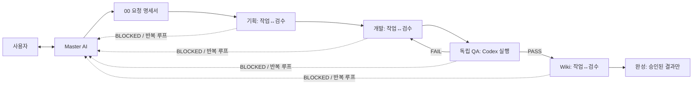
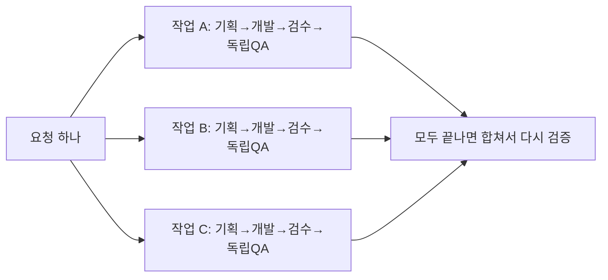
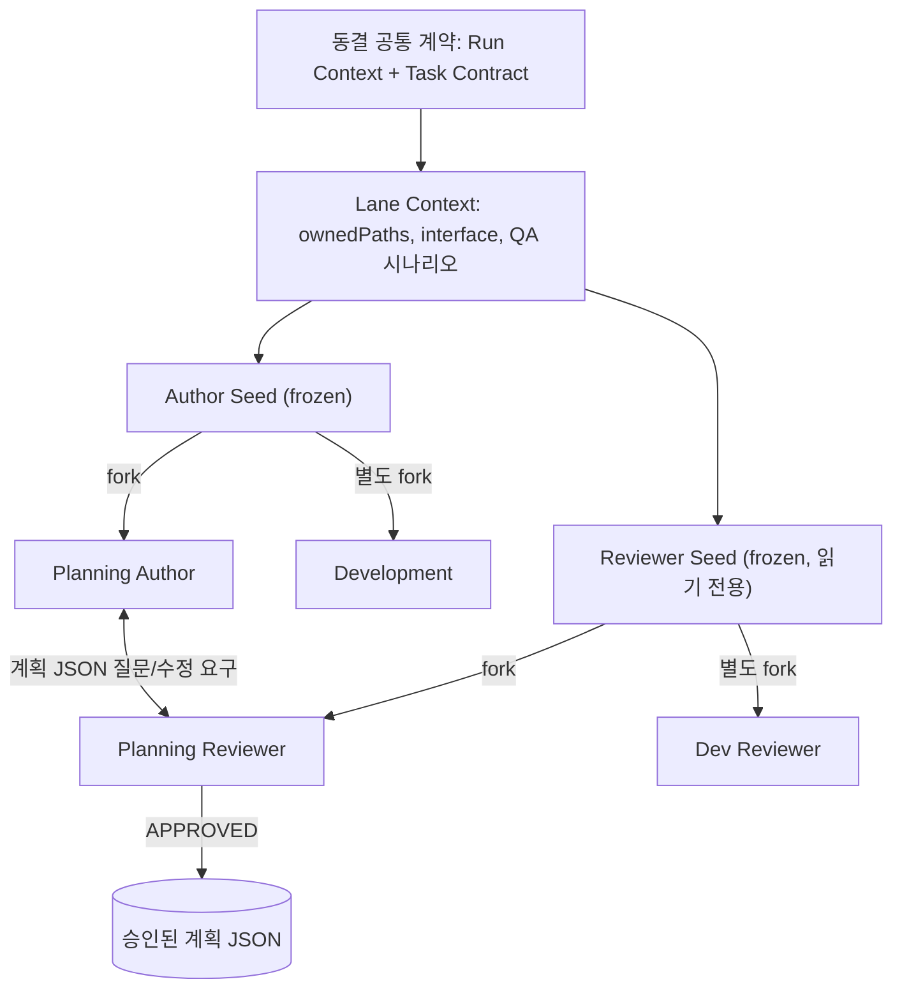

# Agent Workflow 설계도 — 영상 분석 결과

> 출처: **"AI 활용의 정점을 보여드리겠습니다 - [잡담] AI 활용 설명회"** (Uzchowall, 52:39)
> 워크플로우 핵심 설명 구간: **16:00 ~ 42:00**. 앞부분(0~16분)은 AI 산업·경제 잡담, 뒷부분(42분~)은 커리어 조언이라 설계에는 반영하지 않았습니다.

> [!NOTE]
> 근거: 한국어 자동 자막 + 키프레임 50장 + 고해상도 프레임 3장(25:53, 26:15, 34:34). 시각은 영상 기준 타임스탬프입니다.

---

## 1. 한 줄 요약

**사람은 Master AI하고만 대화합니다.** Master는 요청을 명세서로 정리한 뒤 **기획 → 개발 → 독립 QA → Wiki** 파이프라인을 끝까지 돌립니다. 단계마다 **작업 AI가 만들고 검수 AI가 읽기 전용으로 승인할 때까지** 반복하고, 모든 과정은 로컬 파일로 남깁니다. (17:30, 22:00, 슬라이드 2)



---

## 2. 단계별 상세

### 0단계 — 요청 정리 (Master AI) · 22:00~23:00
- 사용자가 "이런 거 만들고 싶어"라고 하면 Master가 **궁금한 점을 전부 질문**합니다. 큰 작업은 1시간 넘게 문답하기도 합니다.
- 결과물은 **`request.md`**(명세서)입니다.
  - 사용자 목표, 확정된 구현 요구사항(예: 요구 30개)
  - **스펙 외 범위**(이번에 하지 않을 것), 주의사항

### 1단계 — 기획 · 23:00~24:00, 슬라이드 4
- 작업 AI가 명세서를 읽고 **개발 TODO**와 **QA 시나리오 목록**을 만듭니다.
- 검수 AI는 명세서와 대조해 **범위와 누락 여부**를 판단합니다. 예: "y축 이동 계약이 비어 있다" → 반려 (33:00)
- 승인이 나야 개발로 넘어갑니다.
- 슬라이드 예시: 구현 범위는 "서로 다른 측정 파일 15개 통합 / 컬럼·단위·시각 형식 통일 / 원본 파일은 변경하지 않음", TODO는 "파일 형식·인코딩 판별 / 단위 변환과 결측값 정리 / 결과 검증 테스트 작성"

### 2단계 — 개발 · 24:00, 32:00, 슬라이드 10
- 개발 AI는 **TODO 리스트만 보고** 작업합니다. 다른 문서는 보지 않습니다.
- **체크는 개발 AI가, 문구 수정은 기획 AI만** 할 수 있습니다.
- **근거 없이는 체크할 수 없습니다.** 할루시네이션을 막기 위한 장치입니다.
  ```
  [x] DEV-002 카드 높이 520px 기본, 320~1,600px 범위를 상태로 도입한다
      완료 근거: QuickVizLocalPage.tsx에 normalHeightPx 추가, 전체화면 높이와 분리
  ```
- 검수 AI는 근거를 따라가 실제로 했는지, 의도에 맞게 했는지 확인합니다. 예: DEV-001~026 구현 근거 확인 후 승인
- 유닛 테스트는 개발 단계에서 돌리지만, 이것만으로는 부족하다고 보고 사람처럼 하는 테스트는 QA로 분리합니다.

### 3단계 — 독립 QA · 24:00~25:00, 27:30, 슬라이드 6
- 개발과 분리된 Codex QA가 승인된 사용자 시나리오를 **실제 화면에서 직접 수행**합니다. 브라우저를 띄워 클릭하고 값을 넣습니다.
- 정상 흐름 외에 **공격적 테스트**(특수문자 입력, 연속 새로고침 등)도 합니다.
- 정상·실패 흐름 모두 **증거를 캡처로 남겨 보고**합니다. 예시 실행에서 증거 파일이 80개였습니다.
- **QA 실패 시 개발 단계로 롤백합니다** (슬라이드 8). 흐름은 결함 발견 → 복구 TODO 작성 → 작업 AI 수정 → 검수 AI 승인 → 독립 QA 재실행이며, 시도와 판단 근거를 모두 기록합니다.

### 4단계 — Wiki · 25:00~26:30, 슬라이드 7
- QA가 끝나면 **이번에 바뀐 파일 기준으로 관련 Wiki 문서만** 갱신합니다.
- Wiki 작업 AI가 쓰고, 검수 AI가 코드와 설명이 일치하는지 읽기 전용으로 확인합니다.
- **최소한으로만 씁니다.** RAG 같은 방식은 과하다고 봅니다. 코드 자체가 맥락이므로 Wiki에는 아키텍처·구조·정책 같은 큰 그림만 MD 인덱스로 둡니다.
- 코드 안에는 **AI 노트(주석)** 를 남깁니다.
- 영상에 나온 Wiki 구조:
  ```
  docs/
  ├─ plan/  setup/  specs/
  └─ wiki/
     ├─ features/   (agent-workflow, model-policy, parallel-workflow,
     │               qa-execution-environment, supervisor-v2, ... )
     ├─ architecture  decisions  index  log  operations
  AGENTS.md  CLAUDE.md  README
  ```

---

## 3. 핵심 운영 원칙

| # | 원칙 | 내용 | 시각 |
|---|---|---|---|
| 1 | **작업/검수 분리** | Codex가 작업하면 Claude가 검수하고, 반대도 가능합니다. 같은 모델끼리 검수하면 오류를 잘 못 잡는다고 합니다 | 18:00~19:30 |
| 2 | **검수 AI는 읽기 전용** | 직접 고치지 않고 수정사항만 제시합니다. 한 모델의 코드 스타일을 유지하기 위해서입니다 | 20:00~21:30 |
| 3 | **승인될 때까지 반복** | 검수 AI가 APPROVE할 때까지 무한 반복합니다 | 21:30 |
| 4 | **루프 방어** | 같은 주제가 2~3회 이상 반복되면 Master를 호출합니다 | 21:30~22:00 |
| 5 | **BLOCKED → Master** | 권한 부족 등으로 워크플로우 안에서 해결이 안 되면 Master를 호출하고, Master가 권한을 준 뒤 재실행합니다 | 26:30~27:00 |
| 6 | **토큰 소진 자동 재개** | 토큰 리셋 시각에 예약 작업을 걸어 자동으로 재개합니다 | 27:00 |
| 7 | **증거 기반** | 개발 체크에는 근거, QA에는 캡처를 요구합니다 | 24:30, 32:00 |
| 8 | **동시 작업+토론 방식은 쓰지 않음** | 두 모델이 동시에 작업하고 합치면 비용이 2배이고 스타일이 꼬여서 채택하지 않았습니다 | 20:30~21:30 |

> [!IMPORTANT]
> 영상에서 가장 강조한 차이점은 **"스킬로 사람이 단계마다 손대는 방식이 아니다"** 라는 점입니다. 전체 파이프라인의 진행, 오류 수정, 재시도를 Master AI가 직접 오케스트레이션합니다. (17:00~18:00)

---

## 4. 병렬 실행 · 34:30~35:30, 슬라이드 12


- Master가 큰 요청을 A/B/C로 쪼갭니다. 갈래마다 같은 네 단계를 그대로 거칩니다.
- **범위나 의존성이 겹치면 나누지 않고 순차로 실행합니다.**
- 레인마다 `ownedPaths`, interface, QA 시나리오를 계약으로 둡니다 (34:34 고해상도 프레임).

---

## 5. 비용 최적화 · 36:00~42:00

1. **단계별 모델 지정을 Master가 합니다.** 기획, 개발, QA, Wiki 모델을 작업 크기에 맞춰 각각 고릅니다 (`model-policy` 문서).
2. **Seed AI와 Forked Session**
   - 공통 맥락(명세, Wiki, 코드 파악)을 먼저 읽힌 **Author Seed**와 **Reviewer Seed** 세션을 만들어 둡니다(frozen).
   - 각 단계는 Seed에서 **session fork**로 시작하고, 끝나면 버립니다. 단계 간 맥락이 섞이지 않게 하기 위해서입니다.
   - 영상에 나온 캐시 히트율: Author Seed 75.6%, Planning Author 85%, Reviewer Seed 86%, Planning Reviewer 93%, 개발은 약 90%
   - 발표자는 "체감상 덜 쓰는 느낌, 정확한 A/B 비교는 안 했다"고 말했습니다.



---

## 6. 실행 기록 구조 · 28:00~30:00, 슬라이드 9·11

```
ai-log/<YYYYMMDD_HHMMSS>_<작업명>/
├─ 00-request/      요청 명세서 (Master와의 대화 정리)   1
├─ 01-planning/     기획 ⇄ 검수                          4
├─ 02-development/  구현 ⇄ 검수                          3
├─ 03-qa/           독립 QA 증거 (캡처)                  80
├─ 04-wiki/         문서 갱신 ⇄ 검수                     4
├─ raw/             주고받은 원본 전체                   63
└─ timeline.md      대화와 판정 전부 (중단/Master 호출/재개 포함)
```
- 파일은 지우지 않고 그대로 둡니다. 예시 실행에서 161개가 남았습니다.
- 판정 이력 예시 (슬라이드 11):

| 단계 | 판정 | 내용 |
|---|---|---|
| 기획 1차 | READY | 요구 30개로 정리해 제출 |
| 기획 검수 1차 | 반려 | 요구는 빠짐없이 담았지만, 확대 상태에서 Y축 이동 계약이 비어 있다 |
| 기획 2차 | READY | 지적 사항 반영 |
| 기획 검수 2차 | 승인 | 코드와 테스트에서 확인 후 승인 |
| 개발·검수 | 승인 | DEV-001~026 구현과 근거 확인 |
| 독립 QA | PASSED | 실제 화면을 조작해 검증 |
| 문서 검수 1차 | 반려 → 2차 승인 | 변경 내용과 문서가 어긋남 |

- 사람은 이 파일들을 직접 볼 필요가 없습니다. **Master에게 "중간에 무슨 에러 났어?"라고 물어보면 됩니다** (31:30).

---

## 7. 발표자 구현 레퍼런스 (25:53 고해상도 프레임)

발표자는 이 워크플로우를 **Node.js 20+ CLI(`agent-workflow`)** 로 만들었고, Codex와 Claude CLI를 하위 프로세스로 구동합니다.

```bash
agent-workflow doctor   --workspace <path>
agent-workflow qa-runtime setup [--slots <1..32>]
agent-workflow run      --mode <plan|full|wiki> --supervisor-client <client> --workspace <path> --request-file <path>
agent-workflow run      --mode full --parallel ...
agent-workflow resume   <run-id> ... [--resolution <text>] [--answer <text>]
agent-workflow status|watch|logs <run-id> --workspace <path> [--view current|index|ledger|timeline|decisions|summary|plan|qa|todo]
agent-workflow list | cleanup
# <client> = codex-desktop | codex-cli | claude-desktop-code | claude-code-cli
```

| 종료 코드 | 의미 |
|---|---|
| 0 | 정상 또는 진행 가능한 체크포인트 |
| 1 | FAIL |
| 20 | NEEDS_ANSWER (Master 답변 필요) |
| 21 | NEEDS_USER (사람 개입 필요) |

QA 신호는 처음에 **PASS / FAIL / BLOCKED** 3개뿐이었는데 부족해서, 포트 부족·브라우저 필요 같은 **세부 이벤트**로 확장했습니다 (33:30~34:30).

---

## 8. 구현 전 결정할 것

> [!WARNING]
> 영상은 **Codex(작업) + Claude(검수)** 두 개의 유료 구독(Claude Max 20 등)을 전제로 합니다. 발표자도 "Max 20을 써도 부족하다"고 했습니다. 비용 구조를 먼저 정해야 합니다.

1. **실행 기반**: 영상처럼 Node CLI가 `codex`·`claude` CLI를 하위 프로세스로 부를지, Antigravity 서브에이전트나 Antigravity SDK로 Master와 작업/검수 에이전트를 구성할지 정해야 합니다.
2. **모델 조합**: 작업과 검수에 각각 어떤 모델을 쓸지(서로 다른 회사 모델 권장) 정해야 합니다.
3. **적용 대상**: 특정 프로젝트(웹앱이면 QA에 Playwright 등 브라우저 자동화 필요)에 붙일지, 범용 도구로 만들지 정해야 합니다.
4. **범위**: MVP(순차 4단계 + 교차검수 + ai-log)부터 할지, 병렬 레인과 Seed/Fork까지 한 번에 할지 정해야 합니다.
